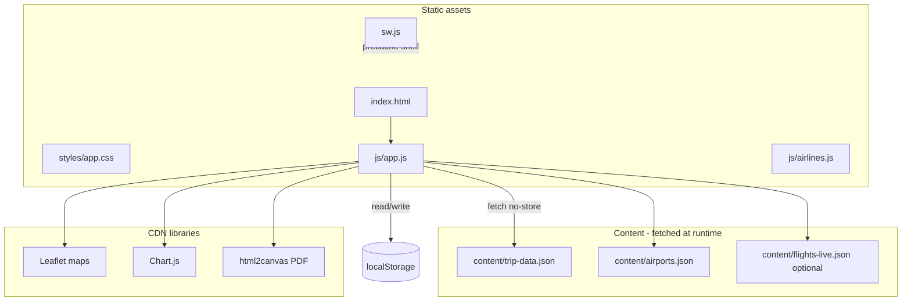

# CQ–XJ Trip Planner · 重庆 × 新疆 行程簿

Privacy-first **static** trip planner for a **Jun 11–23, 2026** route: Singapore → Chongqing → Xinjiang (Duku corridor, grasslands, Sayram Lake) → home. No backend: all data ships as JSON, all edits and backups stay in the browser.

**Shipped version:** `1.1.2` (see `content/trip-data.json` → `appVersion` and `VERSION.md`).

---

## Table of contents

1. [Quick start](#quick-start)
2. [Architecture](#architecture)
3. [Repository layout](#repository-layout)
4. [Content model (`trip-data.json`)](#content-model-trip-datajson)
5. [Application behaviour](#application-behaviour)
6. [Internationalisation (EN / 中文)](#internationalisation-en--中文)
7. [Browser storage & backups](#browser-storage--backups)
8. [Auth gate](#auth-gate)
9. [Scripts & maintenance](#scripts--maintenance)
10. [Extending the planner (human & AI guide)](#extending-the-planner-human--ai-guide)
11. [Deployment](#deployment)
12. [Credits & licensing](#credits--licensing)

---

## Quick start

**Requires a local HTTP server** — opening `index.html` via `file://` will not load JSON (`fetch` is blocked).

```bash
# from repo root
npx --yes serve -l 4173
# open http://127.0.0.1:4173
```

Default demo password: **`china`** (see [Auth gate](#auth-gate) to change).

**Regenerate version markdown after editing `versions[]`:**

```bash
node scripts/generate-version-md.mjs
```

**Rebuild full June itinerary JSON from the generator script:**

```bash
node scripts/build-june-xinjiang-itinerary.mjs
```

---

## Architecture



| Layer | Role |
|--------|------|
| **`content/trip-data.json`** | Single source of truth for copy, itinerary, costs, checklist, maps, UI strings, version metadata |
| **`js/app.js`** | Boot, auth, rendering, edit/history, flights overlay, PDF, onboarding, version merge |
| **`index.html`** | Page shells, modals, `data-ui` / `data-key` anchors |
| **`styles/app.css`** | Glass UI, responsive sidebar drawer, print/PDF helpers |
| **`sw.js`** | PWA installability; caches app shell; **never** caches `content/*.json` (always network-first for trip data) |
| **localStorage** | User edits, checklist ticks, flights overlay, language, auth token, onboarding flags |

**Boot sequence** (`DOMContentLoaded` in `app.js`):

1. `loadTripData()` → populate global arrays (`DAYS_CQ`, `DAYS_XJ1`, `DAYS_XJ2`, `STAYS`, `CHECKLIST`, …)
2. `loadAirports()` → `content/airports.json` for flight typeahead
3. `refreshFlightsFromNetwork()` → optional `content/flights-live.json` merge
4. `applyUiAnchors()` → fill `data-ui` / `data-ui-tools` from `ui.en` / `ui.zh`
5. `checkAuth()` → show gate or continue
6. `init()` → render all sections, maps, charts, version merge check

---

## Repository layout

```
├── index.html              # App shell, sections, modals
├── styles/app.css          # All styles
├── js/
│   ├── app.js              # Main application (~4k lines)
│   └── airlines.js         # Airline search index for flight modal
├── content/
│   ├── trip-data.json      # ★ Primary data file
│   ├── airports.json       # IATA typeahead
│   ├── flights-live.json   # Optional live flight overlay (if present)
│   └── README.md           # Short content-folder notes
├── scripts/
│   ├── build-june-xinjiang-itinerary.mjs  # Regenerate trip-data from itinerary source
│   ├── generate-version-md.mjs            # VERSION.md from versions[]
│   ├── build-china-trip-data.mjs          # Older China fork scaffold
│   ├── extract-trip-data.mjs              # Legacy HTML → JSON extractor
│   ├── build-airports.mjs                 # airports.json builder
│   └── …                                  # Icon/PWA/pdf helpers (Python)
├── sw.js                   # Service worker (cache id: cqxj-planner-v4)
├── manifest.webmanifest    # PWA manifest
├── icons/                  # Favicons & PWA icons
├── splash/                 # Apple startup images
└── VERSION.md              # Generated changelog
```

---

## Content model (`trip-data.json`)

Valid JSON only (double quotes, no trailing commas). Top-level keys:

| Key | Purpose |
|-----|---------|
| `appVersion` | Semver string; drives merge UI, version pill, “What’s new” |
| `versions[]` | Changelog entries: `{ v, date, title, latest, changes[] }` |
| `tripMeta` | `currencySymbol`, `groupSize`, `totalDays`, `statDrivingKmApprox`, `statBudgetApprox` |
| `tripCountdown` | `label`, `start`/`end` `{year,month,day}`, `note` — flight banner countdown |
| `pageSeed` | `overview` hero/captions, `pdf` export section titles (all `{en,zh}`) |
| `ui.en` / `ui.zh` | Flat string map for chrome (`nav.*`, `auth.*`, `tools.*`, …) |
| `itinerary` | Day arrays (see below) |
| `stays[]` | Nightly accommodation cards |
| `checklist[]` | Grouped booking tasks |
| `clMeta` | Per checklist-item metadata: `cat`, `catIcon`, `catColor`, `tripCity`, `tripDate` |
| `costs[]` | Budget table + chart source |
| `tips[]` | Field notes grid |
| `flights[]` | Seed flight legs (UTC ISO timestamps) |
| `mapsData` | `cq` and `xj` map specs |

### Bilingual fields

Any user-facing string in structured data uses:

```json
{ "en": "English text", "zh": "中文" }
```

Resolved at runtime by `Tx(obj)` in `app.js` based on `APP_LANG` (`en` | `zh`).

### Itinerary days

Stored under:

- `itinerary.chongqing[]` — Jun 11–13 (also accepts legacy key `cq`)
- `itinerary.xinjiangNorth[]` — Jun 14–19
- `itinerary.xinjiangSouth[]` — Jun 20–23

Legacy single array `itinerary.xinjiang` is still loaded into north only.

**Day object shape:**

| Field | Type | Notes |
|-------|------|--------|
| `id` | string | Stable id, e.g. `d-jun12` |
| `num` | string | Display sequence, e.g. `"02"` |
| `day` | `{en,zh}` | Weekday label |
| `date` | `{en,zh}` | **Calendar** label shown large on card (`Jun 12` / `6月12日`) |
| `route` | `{en,zh}` | Route line in subtitle (e.g. `Singapore → Chongqing`) |
| `title`, `meta`, `desc` | `{en,zh}` | Card header & body |
| `img` | string | Image URL (Unsplash CDN in current trip) |
| `imgAlt` | `{en,zh}` | Accessibility |
| `timeline[]` | optional | `{ time, icon, label }` each bilingual where needed |
| `activities[]` | optional | `{ icon, name, desc, cost? }` |

Build script `scripts/build-june-xinjiang-itinerary.mjs` is the maintained generator for this structure.

### Stays

```json
{
  "id": "stay-jun12",
  "nights": { "en": "Jun 12", "zh": "6月12日" },
  "name": { "en": "…", "zh": "…" },
  "loc": { "en": "…", "zh": "…" },
  "areas": [{ "en": "…", "zh": "…" }],
  "pills": [{ "en": "…", "zh": "…" }],
  "minPrice": 380,
  "maxPrice": 650,
  "tip": { "en": "…", "zh": "…" },
  "img": "https://…"
}
```

### Checklist

```json
{
  "id": "week",
  "label": { "en": "Book this week", "zh": "本周要订" },
  "sub": { "en": "…", "zh": "…" },
  "color": "#ff3b30",
  "items": [{
    "id": "flt-sin-ckg",
    "icon": "✈️",
    "title": { "en": "…", "zh": "…" },
    "dates": { "en": "…", "zh": "…" },
    "detail": { "en": "…", "zh": "…" },
    "est": { "en": "…", "zh": "…" },
    "where": { "en": "…", "zh": "…" }
  }]
}
```

`clMeta[itemId]` adds `cat`, `catIcon`, `catColor`, `tripCity` (`pre` \| `cq` \| `xj`), and optional `tripDate` (`YYYY-MM-DD`) for date sorting.

### Costs (budget)

```json
{
  "catSlug": "flt",
  "cat": { "en": "Flights", "zh": "机票" },
  "item": { "en": "…", "zh": "…" },
  "total": 16000,
  "pp": 4000,
  "note": { "en": "…", "zh": "…" }
}
```

Charts aggregate by `catSlug`. Currency display uses `tripMeta.currencySymbol` (¥).

### Maps

```json
"mapsData": {
  "cq": {
    "center": [29.563, 106.584],
    "zoom": 11,
    "stops": [{ "lat", "lng", "num", "daytrip": false, "label": {en,zh}, "note": {en,zh} }]
  },
  "xj": { … }
}
```

Rendered with Leaflet + Esri satellite tiles; great-circle polylines between main stops.

---

## Application behaviour

### Pages (sidebar)

| `showPage(id)` | Section | Main data |
|----------------|---------|-----------|
| `overview` | Hero, stats, route summary, **flight board**, dual maps | `pageSeed.overview`, `tripMeta`, `mapsData` |
| `cq` | Chongqing day cards | `itinerary.chongqing` → `#days-cq` |
| `xj1` | North / Duku corridor days | `itinerary.xinjiangNorth` → `#days-xj1` |
| `xj2` | South & homeward days | `itinerary.xinjiangSouth` → `#days-xj2` |
| `stays` | Accommodation list | `stays[]` |
| `budget` | Pie/bar charts + cost table | `costs[]` |
| `tips` | Tip cards | `tips[]` |
| `checklist` | Bookings checklist | `checklist[]`, `clMeta` |

Mobile: hamburger opens sidebar drawer; header has PDF + **trip tools** (gear menu).

### Day cards UI

- **Large text:** `date` (calendar only)
- **Subtitle:** `route` + `meta` via `dayMetaCombined()`
- Expandable timeline, activities, hero image per day
- Cards can be hidden with × (stored in edit snapshot `_deletedCards`)

### Flight board

- Seed rows from `trip-data.json` → `flights[]`
- User edits stored in `localStorage` key `tripleFlightOverlay` (merged by flight `id`)
- Modal add/edit with airport/airline typeahead, connection kinds: `direct`, `same_pnr`, `self_transfer`, `overnight`, `open_jaw`
- Mini route maps on cards; countdown banner uses `tripCountdown` dates
- Optional network refresh from `content/flights-live.json` when published

### Checklist sorting

`setClSort(mode)` — persisted in `tripleClSort`:

| Mode | Groups by |
|------|-----------|
| `urgency` | Original checklist groups |
| `category` | `clMeta.cat` |
| `date` | `clMeta.tripDate` (undated bucket last) |
| `city` | `clMeta.tripCity` |
| `status` | Done vs pending |

Checkboxes → `checklistState` in localStorage.

### Edit mode

**Trip tools → Edit** (`toggleEdit()`):

- Sets `[data-key]` elements to `contentEditable`
- On save, snapshots all `data-key` innerHTML + hidden card ids to `tripHistory` in localStorage
- Does **not** write back to `trip-data.json` (client-only overrides)

Elements need `data-key="unique-id"` and optional `data-label` for history/conflict UI.

### Version merge

When `tripAppVersion` in localStorage ≠ `appVersion` from JSON:

1. Compare user snapshot vs new DOM defaults
2. Auto-merge non-conflicting edits
3. Show conflict modal if same field changed in both app update and user edit

Always bump `appVersion` + add `versions[]` entry when shipping content changes.

### Onboarding (first visit)

Single modal `#onboardingModal`, 4 steps, pill `1 / 4`:

1. Language pick (English / 中文) — reminds user sidebar toggle
2. Welcome intro
3. Feature tips
4. Add to Home Screen (skipped if already installed PWA)

Sets `tripWelcomeSeen`, `tripAddToHomeDismissed`, `tripLastSeenVersion`.

Returning users with new `appVersion` see **What’s new** modal only.

### PDF export

**Trip tools → PDF** or header PDF button:

1. Options modal (sections, map snapshots)
2. `html2canvas` captures `#map-cq` / `#map-xj` if maps were initialised
3. Print-oriented HTML in hidden iframe

Copy uses `pageSeed.pdf` and live DOM for edited `data-key` fields.

### PWA / offline

- `manifest.webmanifest` + `sw.js` for installability
- Shell cached; **trip JSON always fetched fresh** (`cache: 'no-store'` + SW network-first for `/content/*.json`)
- After deploy, bump `CACHE` name in `sw.js` (currently `cqxj-planner-v4`) so clients pick up new `app.js` / CSS

---

## Internationalisation (EN / 中文)

| Mechanism | Use |
|-----------|-----|
| `ui.en` / `ui.zh` | Buttons, nav, modals, auth — keys like `nav.overview`, `tools.pdf` |
| `data-ui="key"` | Static HTML; filled by `applyUiAnchors()` → `Ui(key)` |
| `data-ui-tools="tools.pdf"` | Toolbar labels |
| `{en,zh}` in JSON | Itinerary, checklist, costs, etc. — `Tx()` |
| `.trip-lng--en` / `.trip-lng--zh` | Hard-coded bilingual spans in HTML; toggled by `refreshLangClasses()` |
| `setTripLang('en' \| 'zh')` | Persists `tripleUiLang`, re-renders all dynamic text |

**Rule for new UI:** add the same key to **both** `ui.en` and `ui.zh` (or use `{en,zh}` objects in JSON).

---

## Browser storage & backups

### localStorage keys

| Key | Purpose |
|-----|---------|
| `tripleUiLang` | `en` or `zh` |
| `tripleClSort` | Checklist sort mode |
| `tripleFlightOverlay` | JSON flight edits |
| `tripleFlightBoardCollapsed` | Flight section UI state |
| `checklistState` | `{ itemId: true }` checked map |
| `tripHistory` | Array of edit snapshots |
| `tripFreshSnapshot` | Baseline for version merge |
| `tripAppVersion` | Last seen app version |
| `tripAuthToken` | Hashed auth token (if remember me) |
| `tripWelcomeSeen` | Onboarding completed |
| `tripLastSeenVersion` | For “What’s new” |
| `tripAddToHomeDismissed` | Add-to-home step done |

### Backup format

**Trip tools → Backup & restore** exports `triple-backup` JSON:

```json
{
  "format": "triple-backup",
  "version": 1,
  "exportedAt": "ISO-8601",
  "tripContentVersion": "1.1.2",
  "entries": { "tripleUiLang": "en", … }
}
```

Restore replaces all keys in `TRIPLE_BACKUP_KEYS` (`app.js`). Can be triggered from login screen too.

---

## Auth gate

- Password hashed: `SHA-256(password + salt)` with salt `CQXJ_planner_v1`
- Expected hash stored as `_AH` in `js/app.js`; matching token in `index.html` inline script for instant unlock (`auth-cached` class)
- Demo password: **`china`**

**To change password:**

1. Compute `SHA-256(newPassword + 'CQXJ_planner_v1')` hex string
2. Update `_AH` in `js/app.js` and the inline `tripAuthToken` check in `index.html`

---

## Scripts & maintenance

| Script | When to run |
|--------|-------------|
| `node scripts/build-june-xinjiang-itinerary.mjs` | Rebuild full `trip-data.json` from embedded June itinerary + merge existing `ui` patches |
| `node scripts/generate-version-md.mjs` | Refresh `VERSION.md` from `versions[]` |
| `node scripts/extract-trip-data.mjs path/to/legacy.html` | One-off extraction from old monolithic HTML |
| `node scripts/build-china-trip-data.mjs` | Older scaffold (superseded by June builder for current trip) |
| `python3 scripts/rewrite_pdf_block.py` | Replace `doExportPDF` HTML block after large refactors |

**Hand-editing** `trip-data.json` is fine for small copy tweaks; use the build script for bulk day/stay/checklist regeneration.

---

## Extending the planner (human & AI guide)

### Add a new day

1. Add object to the correct array in `itinerary` (or extend `build-june-xinjiang-itinerary.mjs` and regenerate).
2. Use unique `id`, separate `date` (calendar) and `route` (segment text).
3. Provide `img` + bilingual `imgAlt` (prefer location-specific URLs).
4. Bump `appVersion` and append `versions[]`.

No `app.js` change needed unless you add new fields — extend `dayTpl()` in the build script and optionally `renderDays()` if you introduce new UI blocks.

### Add UI chrome string

1. Add key to `ui.en` and `ui.zh` in `trip-data.json`.
2. Reference in HTML: `data-ui="your.key"` or `data-ui-tools="tools.yourKey"`.
3. Or call `Ui('your.key')` from JS.

### Add a new checklist item

1. Add to a group in `checklist[].items`.
2. Add `clMeta[itemId]` with `cat`, `tripCity`, optional `tripDate`.
3. Regenerate or hand-edit; bump version.

### Add a new page/section

1. Add `<section id="page-foo" class="page">` in `index.html`.
2. Add nav button calling `showPage('foo', this)`.
3. Add render function in `app.js`, call from `init()` and `rerenderTripText()`.
4. Add nav labels to `ui.en` / `ui.zh`.

### Add editable copy on a page

1. Put `data-key="foo-bar"` and `data-label="Human label"` on the element.
2. `captureDomDefaultsFromDom()` runs after init — new keys join version-merge automatically.

### Change trip dates globally

1. Update day objects (build script or JSON).
2. Update `tripCountdown.start` / `end`.
3. Update `clMeta.*.tripDate`, flight seed UTC times, nav date labels (`nav.cq.days`, etc.).
4. Update static route bars in `index.html` if they are not JSON-driven.
5. Bump `appVersion`.

### Fork for a different trip

1. Copy repo; replace itinerary via build script or new `trip-data.json`.
2. Replace `mapsData` coordinates.
3. Update heroes in `index.html` (Unsplash URLs).
4. Reset `appVersion` series if desired.
5. Change auth hash for a private deployment.

### AI agent checklist before opening a PR

- [ ] Valid JSON (`node -e "JSON.parse(require('fs').readFileSync('content/trip-data.json'))"`)
- [ ] `appVersion` bumped; `versions[]` updated; `node scripts/generate-version-md.mjs`
- [ ] Both `ui.en` and `ui.zh` for new keys
- [ ] Bilingual `{en,zh}` for new content fields
- [ ] `sw.js` `CACHE` bumped if `app.js` / CSS / HTML changed materially
- [ ] Test on `npx serve` (not `file://`)
- [ ] No secrets in repo except intentional demo auth hash

---

## Deployment

**GitHub Pages:** repo includes `.nojekyll`. Paths resolve via `document.baseURI` (`contentUrl()`), so project pages (`/repo-name/`) work.

```bash
git push origin main
```

Users may need a hard refresh after updates to activate a waiting service worker.

**Environment:** none — static files only.

---

## Credits & licensing

Private friend build. Hot-linked **Unsplash** images: respect photographer licenses if you fork or redistribute.

| Dependency | Source |
|------------|--------|
| Leaflet 1.9 | unpkg |
| Chart.js 4.4 | jsDelivr |
| html2canvas 1.4 | cdnjs |
| Inter font | Google Fonts |

For content-folder details see [`content/README.md`](content/README.md).
